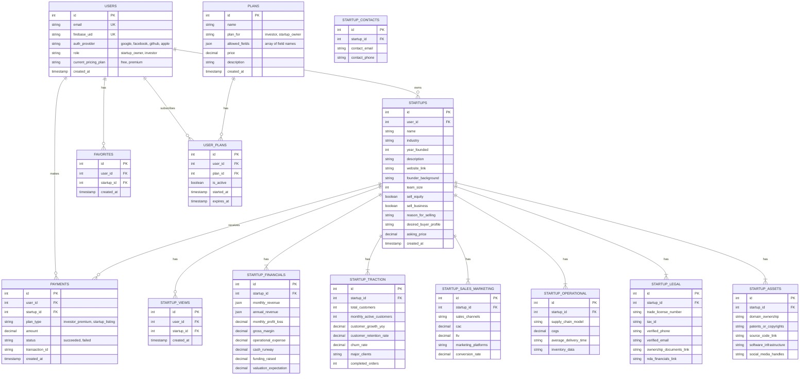

# Database Schema

This document outlines the database schema for the startup investment platform.

## ERD (Entity Relationship Diagram)

## Table Definitions

### `USERS`

Stores user information for both startup owners and investors.

-   `id`: Primary Key
-   `email`: Unique email for login.
-   `firebase_uid`: Unique Firebase user ID.
-   `auth_provider`: Authentication provider (`google`, `facebook`, `github`, or `apple`).
-   `role`: User role (`startup_owner` or `investor`).
-   `current_pricing_plan`: The user's current subscription plan (`free` or `premium`). Defaults to `free`.
-   `created_at`: Timestamp of user creation.

### `STARTUPS`

Core information about each startup.

-   `id`: Primary Key
-   `user_id`: Foreign Key to `USERS` (the owner).
-   `name`: Startup name.
-   ... (all fields from "Basic Business Overview" and "What They Want")

### `STARTUP_FINANCIALS`

-   `id`: Primary Key
-   `startup_id`: Foreign Key to `STARTUPS`.
-   ... (all fields from "Financials")

### `STARTUP_TRACTION`

-   `id`: Primary Key
-   `startup_id`: Foreign Key to `STARTUPS`.
-   ... (all fields from "Traction Metrics")

### `STARTUP_SALES_MARKETING`

-   `id`: Primary Key
-   `startup_id`: Foreign Key to `STARTUPS`.
-   ... (all fields from "Sales & Marketing")

### `STARTUP_OPERATIONAL`

-   `id`: Primary Key
-   `startup_id`: Foreign Key to `STARTUPS`.
-   ... (all fields from "Operational Data")

### `STARTUP_LEGAL`

-   `id`: Primary Key
-   `startup_id`: Foreign Key to `STARTUPS`.
-   ... (all fields from "Legal & Verification")

### `STARTUP_ASSETS`

-   `id`: Primary Key
-   `startup_id`: Foreign Key to `STARTUPS`.
-   ... (all fields from "Company Assets")

### `PAYMENTS`

Tracks all payments made on the platform.

-   `id`: Primary Key
-   `user_id`: Foreign Key to `USERS` (who made the payment).
-   `startup_id`: Foreign Key to `STARTUPS` (if payment is for a specific startup listing).
-   `plan_type`: The type of plan purchased.
-   `amount`: Payment amount.
-   `status`: Payment status.
-   `transaction_id`: From the payment gateway.
-   `created_at`: Timestamp of payment.

### `FAVORITES`

Tracks which startups an investor has favorited.

-   `id`: Primary Key
-   `user_id`: Foreign Key to `USERS` (the investor).
-   `startup_id`: Foreign Key to `STARTUPS` (the favorited startup).
-   `created_at`: Timestamp of when it was favorited.

### `STARTUP_VIEWS`

Tracks views on startup profiles.

-   `id`: Primary Key
-   `user_id`: Foreign Key to `USERS` (the viewer).
-   `startup_id`: Foreign Key to `STARTUPS` (the viewed startup).
-   `created_at`: Timestamp of the view.

### `STARTUP_CONTACTS`

Stores the private contact information for startups, accessible only to premium investors.

-   `id`: Primary Key
-   `startup_id`: Foreign Key to `STARTUPS`.
-   `contact_email`: The private contact email for the startup.
-   `contact_phone`: The private contact phone for the startup.

### `PLANS`

Defines subscription plans that control access to different startup data fields.

-   `id`: Primary Key
-   `name`: The name of the plan (e.g., "Basic Investor", "Premium Investor").
-   `plan_for`: Target user type (`investor` or `startup_owner`).
-   `allowed_fields`: JSON array of field identifiers that this plan grants access to. Possible values include:
    - Section-level: `startup`, `financials`, `traction`, `salesMarketing`, `operational`, `legal`, `assets`, `contacts`
    - Field-level: `startupMarketing`, `startupProfit`, `startupRevenue`, `startupValuation`, `startupCustomers`, `startupGrowth`
-   `price`: The price of the plan.
-   `description`: A description of what the plan offers.
-   `created_at`: Timestamp of plan creation.

### `USER_PLANS`

Links users to their subscribed plans.

-   `id`: Primary Key
-   `user_id`: Foreign Key to `USERS`.
-   `plan_id`: Foreign Key to `PLANS`.
-   `is_active`: Whether the plan subscription is currently active.
-   `started_at`: Timestamp of when the subscription started.
-   `expires_at`: Timestamp of when the subscription expires (nullable for lifetime plans).