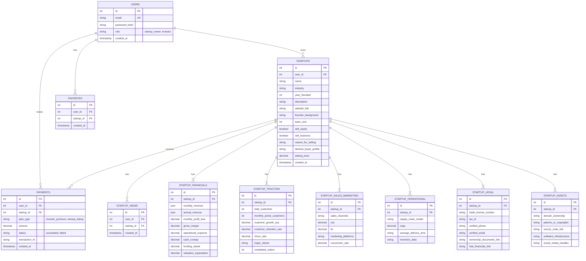

# Database Schema

This document outlines the database schema for the startup investment platform.

## ERD (Entity Relationship Diagram)

## Table Definitions

### `USERS`

Stores user information for both startup owners and investors.

-   `id`: Primary Key
-   `email`: Unique email for login.
-   `password_hash`: Hashed password.
-   `role`: User role (`startup_owner` or `investor`).
-   `created_at`: Timestamp of user creation.

### `STARTUPS`

Core information about each startup.

-   `id`: Primary Key
-   `user_id`: Foreign Key to `USERS` (the owner).
-   `name`: Startup name.
-   ... (all fields from "Basic Business Overview" and "What They Want")

### `STARTUP_FINANCIALS`

-   `id`: Primary Key
-   `startup_id`: Foreign Key to `STARTUPS`.
-   ... (all fields from "Financials")

### `STARTUP_TRACTION`

-   `id`: Primary Key
-   `startup_id`: Foreign Key to `STARTUPS`.
-   ... (all fields from "Traction Metrics")

### `STARTUP_SALES_MARKETING`

-   `id`: Primary Key
-   `startup_id`: Foreign Key to `STARTUPS`.
-   ... (all fields from "Sales & Marketing")

### `STARTUP_OPERATIONAL`

-   `id`: Primary Key
-   `startup_id`: Foreign Key to `STARTUPS`.
-   ... (all fields from "Operational Data")

### `STARTUP_LEGAL`

-   `id`: Primary Key
-   `startup_id`: Foreign Key to `STARTUPS`.
-   ... (all fields from "Legal & Verification")

### `STARTUP_ASSETS`

-   `id`: Primary Key
-   `startup_id`: Foreign Key to `STARTUPS`.
-   ... (all fields from "Company Assets")

### `PAYMENTS`

Tracks all payments made on the platform.

-   `id`: Primary Key
-   `user_id`: Foreign Key to `USERS` (who made the payment).
-   `startup_id`: Foreign Key to `STARTUPS` (if payment is for a specific startup listing).
-   `plan_type`: The type of plan purchased.
-   `amount`: Payment amount.
-   `status`: Payment status.
-   `transaction_id`: From the payment gateway.
-   `created_at`: Timestamp of payment.

### `FAVORITES`

Tracks which startups an investor has favorited.

-   `id`: Primary Key
-   `user_id`: Foreign Key to `USERS` (the investor).
-   `startup_id`: Foreign Key to `STARTUPS` (the favorited startup).
-   `created_at`: Timestamp of when it was favorited.

### `STARTUP_VIEWS`

Tracks views on startup profiles.

-   `id`: Primary Key
-   `user_id`: Foreign Key to `USERS` (the viewer).
-   `startup_id`: Foreign Key to `STARTUPS` (the viewed startup).
-   `created_at`: Timestamp of the view.