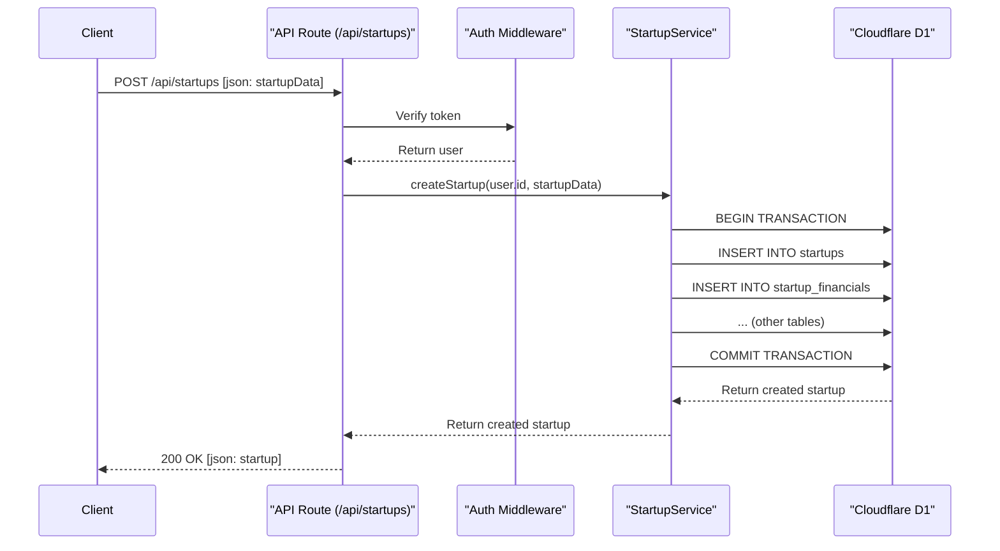

# Service Layer and API Architecture Plan

This document outlines the plan for a more robust and maintainable backend architecture by introducing a dedicated service layer to encapsulate business logic. This approach decouples the API route handlers from the core application logic, making the system easier to test, maintain, and scale.

## 1. Directory Structure

All services will be located in the `src/services` directory. Each service will be responsible for a specific domain (e.g., startups, users, payments).

```
src/
├── services/
│   ├── startup.service.ts
│   ├── user.service.ts
│   ├── favorites.service.ts
│   └── payment.service.ts
└── routes/
    └── api/
        ├── startups/
        │   ├── index.ts      # (GET, POST)
        │   └── $id.ts        # (GET, PUT, DELETE)
        └── favorites/
            └── index.ts      # (GET, POST, DELETE)
```

## 2. Data Types and Interfaces

Before diving into the service implementations, let's define the key data types and interfaces that will be used across the services.

### Input/Output Types

- **`CreateStartupInput`:** Complete startup data for creation (includes all sections).
- **`UpdateStartupInput`:** Partial startup data for updates (all sections optional).
- **`StartupDetails`:** Complete startup data with all related information.
- **`StartupSummary`:** Limited startup data for public listings.
- **`CreateUserInput`:** User data for registration.
- **`UpdateUserProfileInput`:** Partial user data for profile updates.
- **`UserStats`:** User statistics (startup count, favorites, etc.).
- **`StartupFilters`:** Query parameters for filtering startups (industry, team size, etc.).

### Authorization Rules

- **Startup Owners:** Can create, read (full), update, and delete their own startups.
- **Premium Investors:** Can view full startup details including contact information.
- **Free Investors:** Can view limited public startup information.
- **All Users:** Can manage their own favorites and profile.

## 4. Service Layer Design

Each service will be a class that interacts with the database and contains all the business logic related to its domain.

### `startup.service.ts`

This service will handle all CRUD operations and business logic for startup profiles.

- **`StartupService` class:**
  - `constructor(db: Drizzle.db)`
  - `createStartup(userId: number, data: CreateStartupInput): Promise<Startup>`
    - Validates input data.
    - Creates the main startup record and all related sub-records (financials, traction, etc.) in a single database transaction.
    - Ensures that the user has the `startup_owner` role.
  - `getStartupById(startupId: number, user?: AuthUser): Promise<StartupDetails>`
    - Fetches all data for a given startup.
    - Handles authorization:
      - Startup owners can see everything, including view counts.
      - Premium investors can see all details, including contact info.
      - Free investors see limited public data.
    - Increments the view count if the viewer is not the owner.
  - `getPublicStartups(filters: StartupFilters): Promise<Partial<Startup>[]>`
    - Fetches a list of startups for public view.
    - Applies filters for industry, team size, etc.
    - Returns a limited subset of data.
  - `updateStartup(startupId: number, userId: number, data: UpdateStartupInput): Promise<Startup>`
    - Validates input data.
    - Verifies that the user is the owner of the startup.
    - Updates the startup record and all related sub-records in a transaction.
    - **Detailed Update Logic:**
      - **Main Startup Table (`startups`):** Always updated if `startup` data is provided.
      - **Related Tables:** For each related table (financials, traction, salesMarketing, operational, legal, assets, contacts):
        - If data is provided for that section:
          - Check if a record already exists for this startup.
          - If exists: Update the existing record with `onConflictDoUpdate`.
          - If not exists: Insert a new record.
        - If no data is provided for that section: Leave the existing record unchanged.
      - **Transaction Safety:** All operations are wrapped in a database transaction to ensure atomicity.
      - **Partial Updates:** Users can update only specific sections without affecting others.
  - `deleteStartup(startupId: number, userId: number): Promise<void>`
    - Verifies that the user is the owner of the startup.
    - Deletes the startup and all associated data (cascade delete).

### `user.service.ts`

This service will handle user-related operations and profile management.

- **`UserService` class:**
  - `constructor(db: Drizzle.db)`
  - `getUserById(userId: number): Promise<User>`
    - Fetches a user by their ID.
  - `getUserByFirebaseUid(firebaseUid: string): Promise<User | null>`
    - Fetches a user by their Firebase UID.
  - `createUser(userData: CreateUserInput): Promise<User>`
    - Creates a new user record.
    - Used during the authentication process.
  - `updateUserProfile(userId: number, profileData: UpdateUserProfileInput): Promise<User>`
    - Updates a user's profile information.
  - `updatePricingPlan(userId: number, plan: 'free' | 'premium'): Promise<User>`
    - Updates a user's pricing plan.
  - `getUserStats(userId: number): Promise<UserStats>`
    - Returns statistics for a user (e.g., number of startups, favorites, etc.).

### `favorites.service.ts`

This service will manage investors' favorite startups.

- **`FavoritesService` class:**
  - `constructor(db: Drizzle.db)`
  - `addFavorite(userId: number, startupId: number): Promise<void>`
    - Adds a startup to a user's favorites list.
    - Prevents duplicate entries.
  - `removeFavorite(userId: number, startupId: number): Promise<void>`
    - Removes a startup from a user's favorites list.
  - `getFavorites(userId: number): Promise<Startup[]>`
    - Retrieves all favorite startups for a given user.

## 5. API Route Implementation

The API routes will be lean and act as a thin layer that calls the appropriate service methods. They will be responsible for:
1.  Extracting request data (body, params, query).
2.  Authenticating the user.
3.  Calling the corresponding service method.
4.  Returning the response as JSON.

### Startup API (`/api/startups`)

-   **`GET /api/startups`**
    -   Calls `startupService.getPublicStartups(filters)`.
    -   Filters will be passed as query parameters (e.g., `?industry=SaaS&minTeamSize=10`).
-   **`POST /api/startups`**
    -   Requires authentication and `startup_owner` role.
    -   Calls `startupService.createStartup(user.id, request.body)`.

-   **`GET /api/startups/{id}`**
    -   Calls `startupService.getStartupById(id, user)`.
    -   Handles different responses based on user role and plan.

-   **`PUT /api/startups/{id}`**
    -   Requires authentication and ownership.
    -   Calls `startupService.updateStartup(id, user.id, request.body)`.

-   **`DELETE /api/startups/{id}`**
    -   Requires authentication and ownership.
    -   Calls `startupService.deleteStartup(id, user.id)`.

### Favorites API (`/api/favorites`)

-   **`GET /api/favorites`**
    -   Requires authentication.
    -   Calls `favoritesService.getFavorites(user.id)`.
-   **`POST /api/favorites`**
    -   Requires authentication.
    -   Expects `{ startupId: number }` in the request body.
    -   Calls `favoritesService.addFavorite(user.id, startupId)`.
-   **`DELETE /api/favorites`**
    -   Requires authentication.
    -   Expects `{ startupId: number }` in the request body.
    -   Calls `favoritesService.removeFavorite(user.id, startupId)`.

## 6. Mermaid Diagram: Request Flow

Here is a diagram illustrating the flow of a request from the client to the database:



This plan provides a clear separation of concerns and a solid foundation for building out the rest of the application's features.
