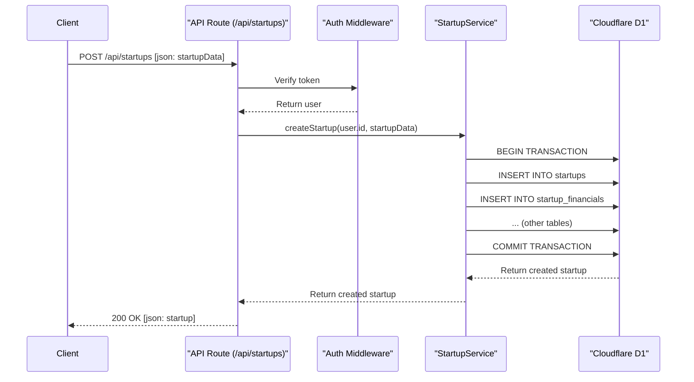

# Service Layer and API Architecture Plan

This document outlines the plan for a more robust and maintainable backend architecture by introducing a dedicated service layer to encapsulate business logic. This approach decouples the API route handlers from the core application logic, making the system easier to test, maintain, and scale.

## 1. Directory Structure

All services will be located in the `src/services` directory. Each service will be responsible for a specific domain (e.g., startups, users, payments).

```
src/
├── services/
│   ├── startup.service.ts
│   ├── user.service.ts
│   ├── favorites.service.ts
│   └── payment.service.ts
└── routes/
    └── api/
        ├── startups/
        │   ├── index.ts      # (GET, POST)
        │   └── $id.ts        # (GET, PUT, DELETE)
        └── favorites/
            └── index.ts      # (GET, POST, DELETE)
```

## 2. Data Types and Interfaces

Before diving into the service implementations, let's define the key data types and interfaces that will be used across the services.

### Input/Output Types

- **`CreateStartupInput`:** Complete startup data for creation (includes all sections).
- **`UpdateStartupInput`:** Partial startup data for updates (all sections optional).
- **`StartupDetails`:** Complete startup data with all related information.
- **`StartupSummary`:** Limited startup data for public listings.
- **`CreateUserInput`:** User data for registration.
- **`UpdateUserProfileInput`:** Partial user data for profile updates.
- **`UserStats`:** User statistics (startup count, favorites, etc.).
- **`StartupFilters`:** Query parameters for filtering startups (industry, team size, etc.).

### Authorization Rules

- **Startup Owners:** Can create, read (full), update, and delete their own startups.
- **Investors with Plans:** Can view startup details based on their subscribed plan's `allowedFields`:
  - Section-level access: `startup`, `financials`, `traction`, `salesMarketing`, `operational`, `legal`, `assets`, `contacts`
  - Field-level access: `startupMarketing`, `startupProfit`, `startupRevenue`, `startupValuation`, `startupCustomers`, `startupGrowth`
- **Investors without Plans:** Cannot view detailed startup information.
- **All Users:** Can manage their own favorites and profile.

## 3. Error Types and Handling

To ensure robust error handling across the service layer and API routes, we define custom error classes that encapsulate different error scenarios. These errors will be thrown by service methods and caught by API routes to return appropriate HTTP responses.

### Custom Error Classes

- **`ValidationError`:** Thrown when input data fails validation (e.g., missing required fields, invalid formats).
- **`NotFoundError`:** Thrown when a requested resource (startup, user) does not exist.
- **`AuthorizationError`:** Thrown when a user lacks permission to perform an action (e.g., updating another user's startup).
- **`ConflictError`:** Thrown when an operation would violate business rules (e.g., duplicate favorite, invalid role transition).
- **`DatabaseError`:** Thrown for database-related issues (e.g., transaction failures, constraint violations).

### Error Handling in Services

Each service method will throw specific errors based on the situation:

- **Validation Errors:** For invalid input data.
- **Not Found Errors:** When entities don't exist.
- **Authorization Errors:** When access is denied.
- **Conflict Errors:** For business rule violations.
- **Database Errors:** For underlying data issues.

### Error Handling in API Routes

API routes will catch errors from service methods and return standardized JSON error responses:

- **400 Bad Request:** For `ValidationError` (include field-specific error details).
- **401 Unauthorized:** For authentication failures.
- **403 Forbidden:** For `AuthorizationError`.
- **404 Not Found:** For `NotFoundError`.
- **409 Conflict:** For `ConflictError`.
- **500 Internal Server Error:** For `DatabaseError` or unexpected errors.

Error response format:
```json
{
  "error": {
    "code": "VALIDATION_ERROR",
    "message": "Invalid input data",
    "details": {
      "field": "name",
      "reason": "Required field is missing"
    }
  }
}
```

## 5. Service Layer Design

Each service will be a class that interacts with the database and contains all the business logic related to its domain.

### `startup.service.ts`

This service will handle all CRUD operations and business logic for startup profiles.

- **`StartupService` class:**
  - `constructor(db: Drizzle.db)`
  - `createStartup(userId: number, data: CreateStartupInput): Promise<Startup>`
    - Validates input data.
    - Creates the main startup record and all related sub-records (financials, traction, etc.) in a single database transaction.
    - Ensures that the user has the `startup_owner` role.
    - **Throws:** `ValidationError` for invalid input, `AuthorizationError` if user lacks startup_owner role, `DatabaseError` for transaction failures.
  - `getStartupById(startupId: number, user?: AuthUser): Promise<StartupDetails>`
    - Fetches all data for a given startup.
    - Handles authorization:
      - Startup owners can see everything, including view counts.
      - Non-owners must have an active plan subscription.
      - Returns only fields allowed by the user's plan(s) `allowedFields`.
    - Increments the view count if the viewer is not the owner.
    - **Throws:** `NotFoundError` if startup does not exist, `AuthorizationError` if user has no active plan.
  - `getUserAllowedFields(userId: number): Promise<PlanAllowedField[]>`
    - Fetches all allowed fields from the user's active plan subscriptions.
    - Merges fields from multiple active plans if applicable.
  - `filterStartupDetailsByAllowedFields(startupDetails: StartupDetails, allowedFields: PlanAllowedField[]): Partial<StartupDetails>`
    - Filters startup details based on allowed fields from user's plan.
    - Supports both section-level and field-level access control.
  - `getPublicStartups(filters: StartupFilters): Promise<Partial<Startup>[]>`
    - Fetches a list of startups for public view.
    - Applies filters for industry, team size, etc.
    - Returns a limited subset of data.
  - `updateStartup(startupId: number, userId: number, data: UpdateStartupInput): Promise<Startup>`
    - Validates input data.
    - Verifies that the user is the owner of the startup.
    - Updates the startup record and all related sub-records in a transaction.
    - **Detailed Update Logic:**
      - **Main Startup Table (`startups`):** Always updated if `startup` data is provided.
      - **Related Tables:** For each related table (financials, traction, salesMarketing, operational, legal, assets, contacts):
        - If data is provided for that section:
          - Check if a record already exists for this startup.
          - If exists: Update the existing record with `onConflictDoUpdate`.
          - If not exists: Insert a new record.
        - If no data is provided for that section: Leave the existing record unchanged.
      - **Transaction Safety:** All operations are wrapped in a database transaction to ensure atomicity.
      - **Partial Updates:** Users can update only specific sections without affecting others.
    - **Throws:** `ValidationError` for invalid input, `NotFoundError` if startup does not exist, `AuthorizationError` if user is not the owner, `DatabaseError` for transaction failures.
  - `deleteStartup(startupId: number, userId: number): Promise<void>`
    - Verifies that the user is the owner of the startup.
    - Deletes the startup and all associated data (cascade delete).
    - **Throws:** `NotFoundError` if startup does not exist, `AuthorizationError` if user is not the owner, `DatabaseError` for deletion failures.

### `user.service.ts`

This service will handle user-related operations and profile management.

- **`UserService` class:**
  - `constructor(db: Drizzle.db)`
  - `getUserById(userId: number): Promise<User>`
    - Fetches a user by their ID.
    - **Throws:** `NotFoundError` if user does not exist.
  - `getUserByFirebaseUid(firebaseUid: string): Promise<User | null>`
    - Fetches a user by their Firebase UID.
  - `createUser(userData: CreateUserInput): Promise<User>`
    - Creates a new user record.
    - Used during the authentication process.
    - **Throws:** `ValidationError` for invalid input, `ConflictError` if user already exists, `DatabaseError` for insertion failures.
  - `updateUserProfile(userId: number, profileData: UpdateUserProfileInput): Promise<User>`
    - Updates a user's profile information.
    - **Throws:** `ValidationError` for invalid input, `NotFoundError` if user does not exist, `AuthorizationError` if attempting to update another user's profile, `DatabaseError` for update failures.
  - `updatePricingPlan(userId: number, plan: 'free' | 'premium'): Promise<User>`
    - Updates a user's pricing plan.
    - **Throws:** `NotFoundError` if user does not exist, `ValidationError` for invalid plan, `DatabaseError` for update failures.
  - `getUserStats(userId: number): Promise<UserStats>`
    - Returns statistics for a user (e.g., number of startups, favorites, etc.).
    - **Throws:** `NotFoundError` if user does not exist.

### `favorites.service.ts`

This service will manage investors' favorite startups.

- **`FavoritesService` class:**
  - `constructor(db: Drizzle.db)`
  - `addFavorite(userId: number, startupId: number): Promise<void>`
    - Adds a startup to a user's favorites list.
    - Prevents duplicate entries.
    - **Throws:** `NotFoundError` if user or startup does not exist, `ConflictError` if already in favorites, `DatabaseError` for insertion failures.
  - `removeFavorite(userId: number, startupId: number): Promise<void>`
    - Removes a startup from a user's favorites list.
    - **Throws:** `NotFoundError` if user or startup does not exist, `DatabaseError` for deletion failures.
  - `getFavorites(userId: number): Promise<Startup[]>`
    - Retrieves all favorite startups for a given user.
    - **Throws:** `NotFoundError` if user does not exist.

### `plan.service.ts` (Future Implementation)

This service will manage subscription plans and user plan subscriptions.

- **`PlanService` class:**
  - `constructor(db: Drizzle.db)`
  - `getAllPlans(planFor?: 'investor' | 'startup_owner'): Promise<Plan[]>`
    - Fetches all available plans, optionally filtered by target user type.
  - `getPlanById(planId: number): Promise<Plan>`
    - Fetches a specific plan by ID.
    - **Throws:** `NotFoundError` if plan does not exist.
  - `createPlan(data: CreatePlanInput): Promise<Plan>`
    - Creates a new subscription plan (admin only).
    - **Throws:** `ValidationError` for invalid input, `AuthorizationError` if user is not admin.
  - `subscribeToPlan(userId: number, planId: number): Promise<UserPlan>`
    - Subscribes a user to a plan.
    - **Throws:** `NotFoundError` if plan does not exist, `ConflictError` if already subscribed.
  - `unsubscribeFromPlan(userId: number, planId: number): Promise<void>`
    - Unsubscribes a user from a plan (sets `is_active` to false).
    - **Throws:** `NotFoundError` if subscription does not exist.
  - `getUserPlans(userId: number): Promise<Plan[]>`
    - Fetches all active plans for a user.

## 6. API Route Implementation

The API routes will be lean and act as a thin layer that calls the appropriate service methods. They will be responsible for:
1.  Extracting request data (body, params, query).
2.  Authenticating the user.
3.  Calling the corresponding service method.
4.  Returning the response as JSON.
5.  Handling errors thrown by service methods and returning appropriate HTTP status codes and error messages.

### Startup API (`/api/startups`)

-   **`GET /api/startups`**
    -   Calls `startupService.getPublicStartups(filters)`.
    -   Filters will be passed as query parameters (e.g., `?industry=SaaS&minTeamSize=10`).
-   **`POST /api/startups`**
    -   Requires authentication and `startup_owner` role.
    -   Calls `startupService.createStartup(user.id, request.body)`.

-   **`GET /api/startups/{id}`**
    -   Calls `startupService.getStartupById(id, user)`.
    -   Handles different responses based on user role and plan.

-   **`PUT /api/startups/{id}`**
    -   Requires authentication and ownership.
    -   Calls `startupService.updateStartup(id, user.id, request.body)`.

-   **`DELETE /api/startups/{id}`**
    -   Requires authentication and ownership.
    -   Calls `startupService.deleteStartup(id, user.id)`.

### Favorites API (`/api/favorites`)

-   **`GET /api/favorites`**
    -   Requires authentication.
    -   Calls `favoritesService.getFavorites(user.id)`.
-   **`POST /api/favorites`**
    -   Requires authentication.
    -   Expects `{ startupId: number }` in the request body.
    -   Calls `favoritesService.addFavorite(user.id, startupId)`.
-   **`DELETE /api/favorites`**
    -   Requires authentication.
    -   Expects `{ startupId: number }` in the request body.
    -   Calls `favoritesService.removeFavorite(user.id, startupId)`.

## 7. Mermaid Diagram: Request Flow

Here is a diagram illustrating the flow of a request from the client to the database:



This plan provides a clear separation of concerns and a solid foundation for building out the rest of the application's features.
